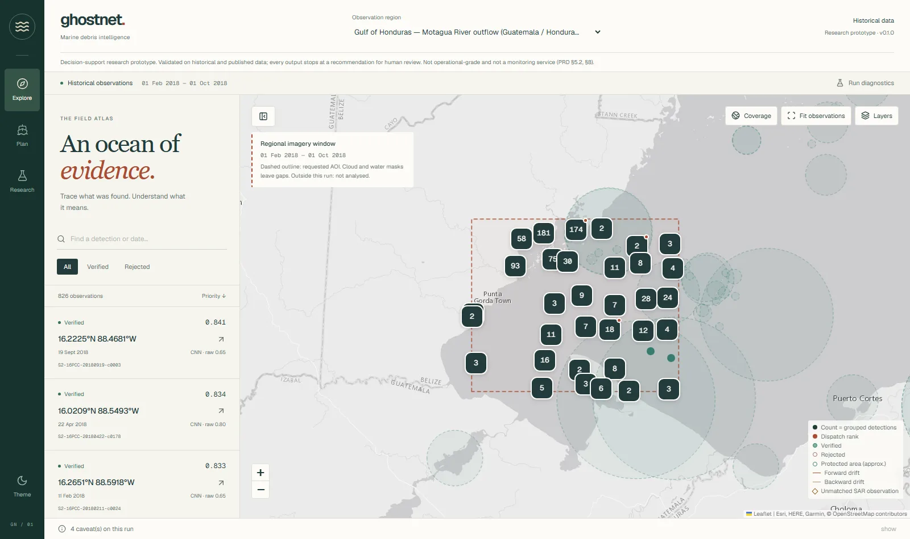
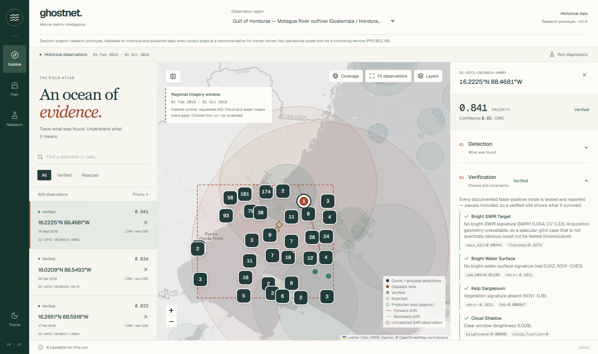
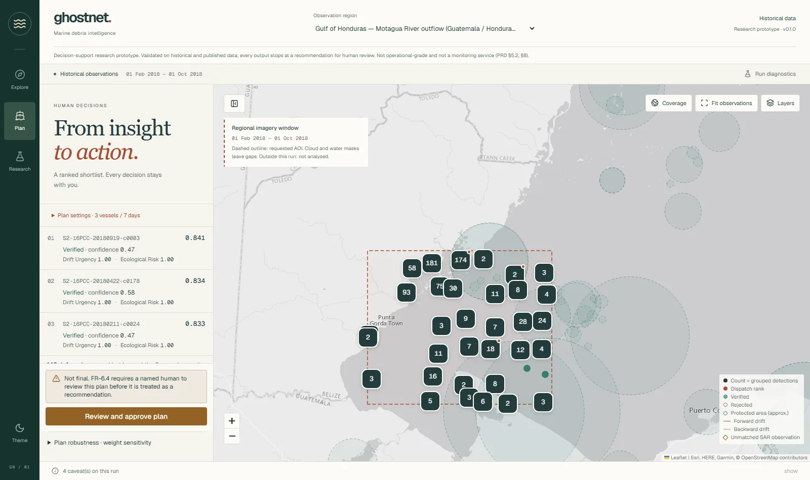
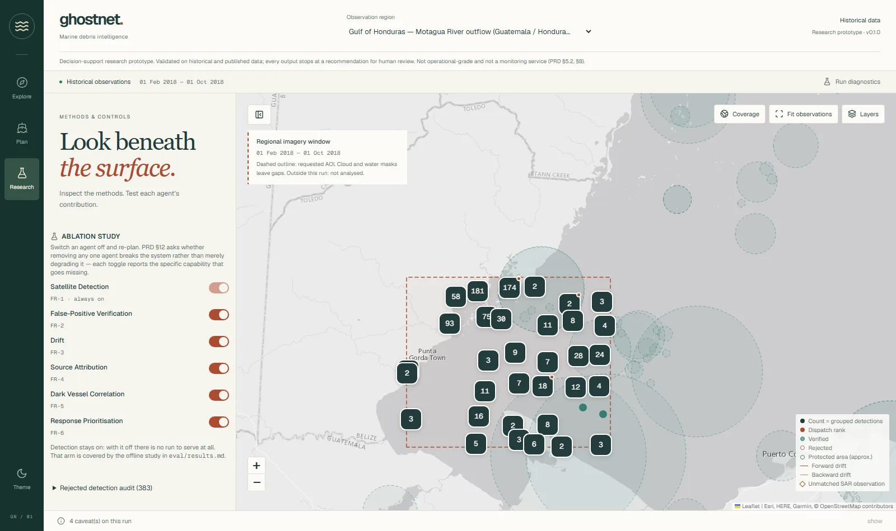
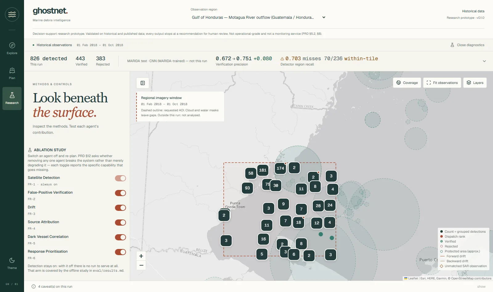

# GhostNet — Multi-Agent Ghost Net & Marine Debris Intelligence

A six-agent research prototype that turns free satellite imagery into a
**verified, source-attributed, risk-prioritised cleanup recommendation**, with
every step's evidence attached and a named human sign-off before anything is
treated as final.



> Research prototype, validated on historical and published data. Detections are
> **candidates, not confirmed ghost nets**. Not operational-grade; every output
> stops at a recommendation for human review.

**Live console:** <https://ghostnet-operator-console.onrender.com> (free tier: may
take a minute to wake). An [offline copy](#offline-copy) runs from a file with no
server or network.

## How it works

```mermaid
flowchart TD
    S2["Sentinel-2 L2A imagery<br/>(Planetary Computer, streamed)"] --> D
    D["1 · Detection<br/>FDI index or CNN (U-Net)"] --> V
    V["2 · Verification<br/>sun glint · foam · kelp · cloud shadow · repeat pass"] --> DR
    DR["3 · Drift<br/>backward + forward ensemble trajectories"] --> A
    A["4 · Source attribution<br/>ranked candidate rivers"] --> VC
    VC["5 · Vessel correlation<br/>SAR vs AIS near the backtrack"] --> P
    P["6 · Prioritisation<br/>capacity-bounded ranked plan + rationale"] --> C
    C["Operator console<br/>evidence inspector · plan · research"] --> H
    H{{"Human approval<br/>(FR-6.4, named reviewer)"}}

    MARIDA[("MARIDA<br/>labelled benchmark")] -. trains / evaluates .-> D
    MARIDA -. fits thresholds .-> V
    OSCAR[("NOAA OSCAR<br/>surface currents")] -.-> DR
    RIV[("Meijer 2021<br/>river emissions")] -.-> A
    GFW[("Global Fishing Watch<br/>SAR + AIS")] -.-> VC
    MPA[("Protected Planet<br/>WDPA")] -.-> P

    PROV["Provenance: every served number traces to a committed artefact<br/>(ghostnet.provenance, checked in CI)"]
    PROV ~~~ C
```



Every detection carries its evidence through the whole chain: the scene it came
from, each verification check's measured value, the drift ensemble, ranked
source rivers, any nearby unmatched SAR observations and the priority score with
its ingredients. **Rejected detections keep their evidence too.** An operator
can see what was thrown out and why.

## Verified headline results

Every figure below is copied from a committed artefact under `eval/`. Methods
and caveats are in [eval/results.md](eval/results.md).

| Result | Value | Artefact |
|---|---|---|
| Verification over the FDI baseline, held-out MARIDA test | precision **0.2381 → 0.623**, F1 0.3846 → 0.7525 | `marida_ablation.json` |
| FDI detector region recall | **0.4068**, the weakest published number, shown beside the gain | `marida_ablation.json` |
| CNN detector (within-tile) | region recall **0.7034**, precision 0.6716; verification adds **+0.080 precision** | `detector_cnn_test.json` |
| Strict geographic holdout, tile never seen in training | PR-AUC 16PDC **0.581**, 48PZC **0.923** (no-skill 0.0010 / 0.0021) | `geographic_candidates.json` |
| Full-input system run, Honduras | 17.0 min end to end; top priority 0.841 | `latency_full_inputs.json`, `ablation_system_full_inputs.json` |

Real runs in the console: **Honduras 826 candidates / 443 verified; Gonâve 247 / 65
(held-out detector); Puducherry 117 / 6 (exploratory; GFW data unavailable, not zero vessels)**. These are pipeline
outputs, not confirmed debris.

## What the console does

| | |
|---|---|
|  | **Evidence inspector.** Each verification check with its measurement, drift tracks, source rivers, vessel observations and the priority breakdown. |
|  | **Plan.** Top-ranked sites assigned to the available boats. Nothing is final until a named reviewer approves. |
|  | **Research.** Switch any agent off and re-plan to see exactly what it contributes, plus a full audit of rejections. |
|  | **Diagnostics.** The verification gain is always shown beside the detector's region recall, at the same size. |

## Evaluation — what was measured, including what did not work

- **Verification is the load-bearing agent.** Removing it *raises* the top score,
  because the highest-scoring site becomes an unrejected false positive.
- **Multi-temporal verification (FR-2.2) is inert.** It contributes nothing even
  with real currents. A drift-aware matcher changed zero rows, because a five-day
  drift envelope is scene-sized.
- **Drift** was checked against 19 drogued buoy tracks from 2014 (not the demo
  window). Error is bimodal in horizon, and the uncertainty envelope is miscalibrated.
- **Source attribution** agrees with the emission ranking it uses as input. That
  is consistency, not accuracy: independent source labels don't exist yet.
- **Vessel correlation** reports grid observations of AIS-unmatched SAR detections.
  They are leads, not identified vessels and not evidence of wrongdoing.

## Getting started

```bash
python scripts/check_machine.py              # what this machine can do (GPU or not)
python -m pip install -r requirements-base.txt
python scripts/run_pipeline_demo.py          # synthetic inputs: the wiring, not a result
python -m pytest                             # no data or credentials needed
```

Workstation only (RTX 50-series needs CUDA 12.8+):
`python -m pip install -r requirements-gpu.txt --index-url https://download.pytorch.org/whl/cu128`.
Credentials go in `.env` (copy `.env.example`). Nothing large is committed:
`python scripts/fetch_data.py --status` shows what is present and how to get the rest.

### Run the console

```bash
python -m pip install -r requirements-web.txt
cd frontend && npm install && npm run build && cd ..
uvicorn ghostnet.webapp.app:app --port 8000   # then open http://localhost:8000
```

`/api/health` is liveness and `/api/ready` is readiness.

### Offline copy

```bash
python scripts/build_static_export.py        # writes static_export/index.html
```

It opens from a file with no server and no network. It's read-only: approvals
and live ablation need the server, and the page says so.

## Limitations

- MARIDA splits by patch; most test patches share tiles with training. Strict
  holdouts exist for two tiles only, with low label support.
- MARIDA labels are sparse, so candidate precision can only be bounded, not measured.
- No independent ground truth for the exported regions, including Puducherry.
- No independent labels for river sources, vessel activity (GFW) or local debris
  reports, so attribution and vessel correlation are checked for consistency only.
  Where GFW data is missing, vessel activity is unavailable, not zero.
- Coverage outlines show requested study areas, not cloud-free observation.
- Drift uses a time-mean current field; uncertainty is not calibrated physically.

## Deployment

One Docker image builds the frontend and serves it with the API. `render.yaml`
defines the free-tier service. See [DEPLOY.md](DEPLOY.md) for setup, approval
storage options and free-tier caveats. CI (`.github/workflows/ci.yml`) runs lint,
tests, provenance, frontend checks and a Docker smoke test, with no GPU, keys or data.

## Research documentation

[PRD.md](PRD.md) · [eval/results.md](eval/results.md) · [docs/ablation-study.md](docs/ablation-study.md) ·
[docs/evidence-traceability.md](docs/evidence-traceability.md) ·
[docs/river-attribution-validation.md](docs/river-attribution-validation.md) ·
[docs/accessibility-qa.md](docs/accessibility-qa.md) · [MACHINE-WORKFLOW.md](MACHINE-WORKFLOW.md)
(two-machine workflow; read first in any new session).
