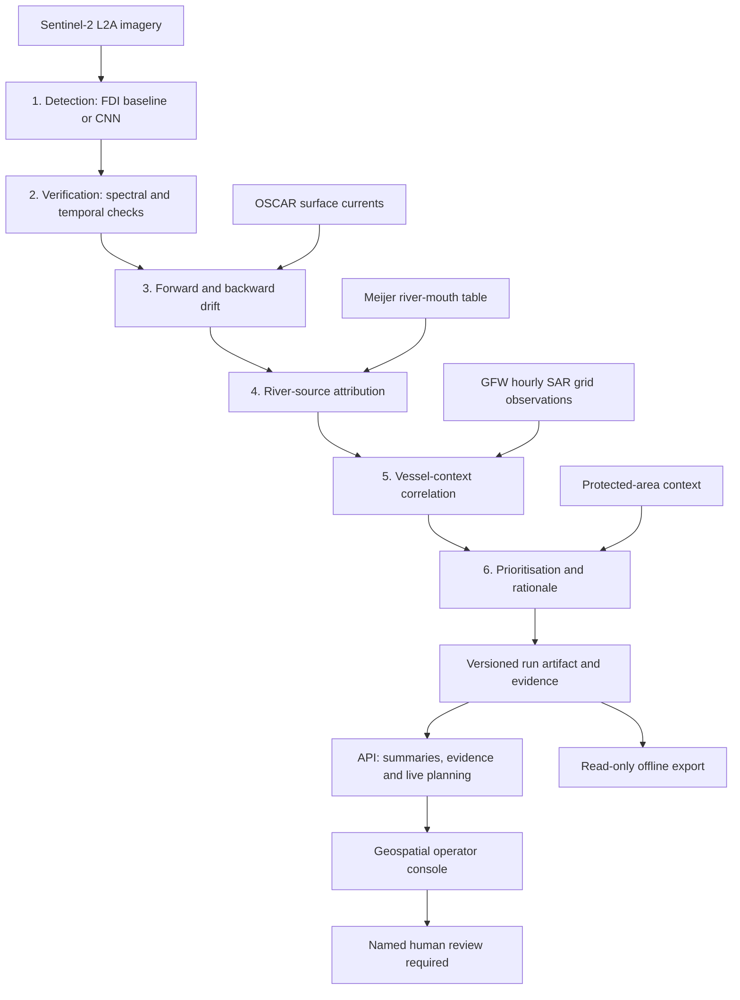
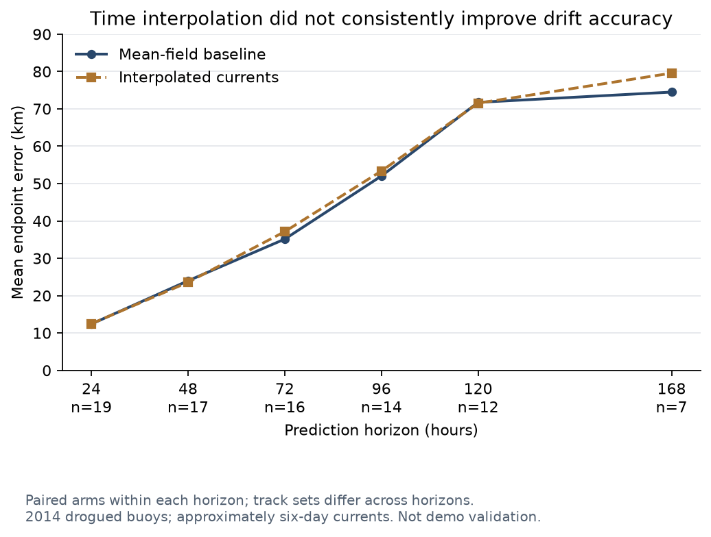
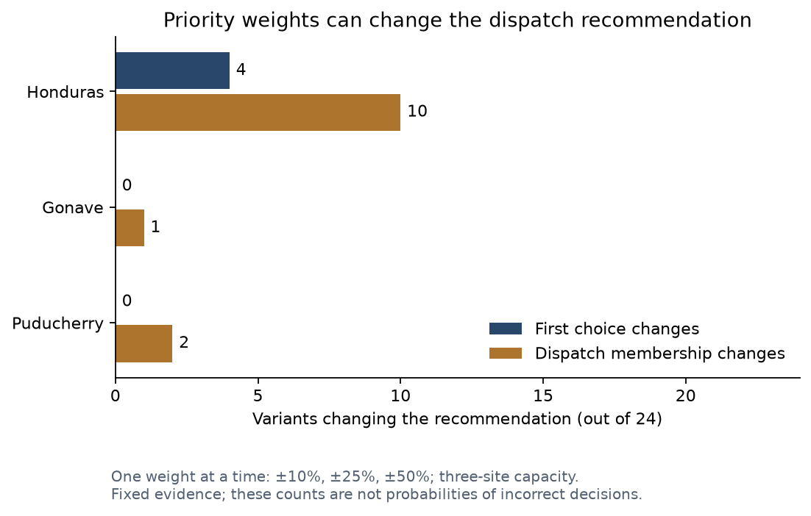

# GhostNet: evidence-led report draft

Prepared 21 September 2026 against merged main `4d7304b`. This is a technical
report draft for team and guide review, not a completed literature review or a
claim of operational readiness. No new experiments were run for this document.

## Abstract

GhostNet is a decision-support research prototype that connects satellite-based
marine-debris candidate detection to verification, drift modelling, source
attribution, vessel context and prioritised recommendations. A sequential
six-agent pipeline exports reproducible evidence for an operator console with
named human review. The released dataset contains three historical regional
runs and one clearly labelled synthetic demonstration. Benchmark evaluation
supports improved detection and verification, while geographic transfer,
trajectory uncertainty and independent source/vessel validation remain material
limitations. Detection records represent candidates across acquisitions, not
confirmed ghost nets or counts of unique debris objects.

## 1. Problem, objective and scope

A detection alone does not explain whether a candidate is plausible, where it
may move, which sources are plausible, or why it merits investigation. This
project links these questions into an inspectable workflow. The objective is
traceable decision support, not autonomous cleanup, law-enforcement attribution
or a global monitoring service. The prototype analyses bounded historical
imagery windows; blank areas in the atlas mean unanalysed areas, not clean water.

## 2. System design and implementation

The arrows between agents show orchestration order. Agents access shared run
state; attribution is explanatory context and does not itself alter dispatch
ranking. The LangGraph pipeline records missing or ablated inputs explicitly.
Optional unavailable inputs may be accepted with `--allow-degraded`; imagery
remains mandatory, and strict export rejects missing required inputs. Missing
scoring signals are omitted with weight redistribution, not interpreted as safe
or zero-risk evidence.

The workstation performs acquisition, CNN inference and trajectory processing.
Portable artifacts carry results to the web service, which serves evidence and
recomputes planning. The React/Leaflet console supports candidate selection,
verified/rejected evidence, layer controls, regional coverage, diagnostics and
human review. Coverage uses lightweight run summaries rather than downloading
all artifacts. Static export bundles data and precomputed plans; approval and
live ablation require the server. Map tiles may still require connectivity.

GFW integration preserves hourly grid-observation semantics. Aggregated SAR
counts are not counts of distinct AIS-silent vessels. Cache validation checks
spatial/time coverage and converts malformed caches into explicit unavailable
inputs. AIS-unmatched context is an investigation signal, not proof of
illegality or of a debris source.

Sources: [pipeline](../src/ghostnet/pipeline.py), [export schema](../src/ghostnet/export.py),
[GFW integration](gfw-integration.md), [provenance](evidence-traceability.md).

## 3. Evaluation method

The detector and verification studies use MARIDA. Threshold fitting uses train;
CNN epoch/probability selection uses validation. Test results are reported
separately. Sparse labels mean unlabelled candidates are excluded rather than
counted as false positives: the FDI test emits 6074 candidates, of which 336
are labelled. Region recall measures overlap with annotated debris regions,
not recall conditioned on already-detected candidates.

MARIDA splits patches rather than geography: 327 of 359 test patches (91%)
share tiles with training. The principal detector result is therefore within-tile.
A separate 18QYF experiment compares models on the same 84 patches with and
without that tile in train/validation. This is a limited transfer experiment,
not proof of generalisation across oceans.

## 4. Measured results and their limits

| Experiment | Recorded result | Interpretation and boundary |
|---|---|---|
| FDI verification ablation | Precision 0.238 to 0.623; F1 0.385 to 0.753 | Candidate-level MARIDA result; pair with detector region recall 0.407 |
| CNN versus FDI | Region recall 0.407 to 0.703; 96 versus 166 of 236 annotated regions hit | Within-tile test; not local export accuracy |
| Verification behind CNN | Precision gain +0.080, versus +0.385 behind FDI | Verification benefit depends on the detector |
| Geographic holdout | Debris F1 0.9304 to 0.8581 on the identical 84 patches | One-region comparison; training-data volume also differs |
| FR-2.2 with real OSCAR | Headline pair F1 0.500 to 0.500; zero marginal rejections | Earlier harmful rejections disappear, but no measured gain; not a positive contribution |
| Drift model check | 19 tracks, 406 observations in 2014; mean track error 34.639 km; mean envelope inclusion 24.52% | Other-year model check, not validation of the 2018 demo |
| Drift horizon split | Mean error 10.46 km at <=4.5 days, 48.74 km beyond | Small groups (7 and 12 tracks); seven-day use remains weak |
| Latency (historical) | 934.03 seconds (15.6 minutes), including 845.96 seconds ingestion | One workstation run; GFW unavailable; cold start not asserted; serialization excluded |
| Latency (full inputs) | 1017.24 seconds (17.0 minutes), including serialization | One workstation run with GFW present; cache state not controlled |

Numerical sources: [results and caveats](../eval/results.md),
[FDI](../eval/detector_fdi_test.json), [CNN](../eval/detector_cnn_test.json),
[verification](../eval/marida_ablation.json),
[trained holdout arm](../eval/holdout_18QYF_leaky.json),
[unseen holdout arm](../eval/holdout_18QYF.json),
[real-current temporal check](../eval/multitemporal_oscar.json),
[drift](../eval/drift.json), [latency](../eval/latency.json).

The system-level ablation in [ablation_system.json](../eval/ablation_system.json)
was measured before GFW became available. Removing detection or prioritisation
eliminates dispatch output. Removing verification admits all 826 candidates;
removing drift also removes source attribution. Removing attribution leaves
ranking unchanged. The vessel-ablation row is uninformative because vessel
inputs were already missing. This study must not be described as a completed
all-six-agent real-input contribution test. A September 22 repeat now exists at
[ablation_system_full_inputs.json](../eval/ablation_system_full_inputs.json),
with all inputs present. Removing vessels changes the top score from 0.8410 to
0.8511; attribution removes source explanations while leaving scores unchanged.
These demonstrate functional dependencies, not independently verified decisions.

September 22 additions are recorded in [results.md](../eval/results.md):
weight sensitivity changes the three-site dispatch membership in 10/24 Honduras,
1/24 Gonave and 2/24 Puducherry perturbations. A paired current-field study on
the same 19 historical buoys finds no consistent improvement from interpolation
of six-day current snapshots: seven-day endpoint error is 74.49 km (mean field)
versus 79.55 km (temporal), on seven complete tracks. Internal separate-buoy
radius calibration improves envelope coverage but requires average radii of
51.62–57.76 km; it does not improve mean paths. Neither experimental drift change
is promoted into the released console.

Figures are generated directly from the measured JSON by
`scripts/plot_research_results.py`; SVG versions are available in `docs/figures/`.

Attribution near the Motagua provides a plausibility check: the published
results table reports Motagua ranked first for 58% of 26 verified candidates
15–30 km from the annotated mouth, and both candidates within 15 km. These
are spatial/model behaviour findings, not confirmed source labels. Comparison
with independently published river rankings remains outstanding. River names
attached by this project must be distinguished from the source dataset.

## 5. Released regional demonstrations

| Run | Candidate records | Passed verification | Rejected | Input status |
|---|---:|---:|---:|---|
| Gulf of Honduras | 826 | 443 | 383 | Real inputs including GFW |
| Gulf of Gonave | 247 | 65 | 182 | Real inputs including GFW; holdout provenance retained |
| Puducherry coast | 117 | 6 | 111 | Partial: GFW unavailable |
| Synthetic coastal demo | 7 | 3 | 4 | Illustrative only |

Source: committed [run artifacts](../webapp_data/). Passing verification is an
algorithmic decision, not field confirmation. Repeated acquisitions can observe
the same physical feature; these counts cannot establish debris abundance.
Puducherry is a bounded Bay of Bengal pilot, not Indian Ocean-wide coverage.
Missing GFW there means unknown evidence, never zero vessels.

## 6. Software and release evidence

PRs #14, #13, #15, #16 and #12 are merged; baseline main is `4d7304b`.
Recorded checks: workstation 422 Python tests; Mac 407 Python tests with the CNN
module skipped; 12 frontend tests, production build and provenance audit passed.
These are historical software checks, not new scientific measurements.

The project handoff reports September 21 verification of the live Render
console with four runs, coverage navigation, partial-input labelling, benchmarks
and evidence panels. That observation is supplied by the release handoff and
was not independently repeated while writing this draft. Health alone does not
identify the exact deployed revision.

The final Mac offline bundle is `static_export/release-2026-09-21/index.html`
(about 8.8 MiB, four runs). Generated files are machine-local and ignored by Git.
Manual direct-file opening remains outstanding; browser automation blocked file
URLs. Do not describe that acceptance check as completed.

## 7. Limitations and remaining external validation

- No field-confirmed ghost-net inventory or independently labelled local
  accuracy assessment for the three exported runs.
- The 2014 drift sample is small; zero drifters crossed the demo region during
  its 2018 window. Time-mean currents and poor envelope inclusion limit long
  predictions. The horizon association does not by itself prove the cause.
- FR-2.2 contributes no measured improvement with real currents. Further
  matching-method work requires a new controlled evaluation.
- Source attribution lacks independent published-ranking/reference comparison;
  vessel correlation lacks independent case-study or matching-accuracy evidence.
- Full-input ablation and latency were repeated September 22. Removing vessels
  changes scoring; the pipeline plus local serialization takes 1017.24 seconds
  (17.0 minutes). This is one run without a cold-cache guarantee, not an SLA.
- Priority scores and rationale text are recommendations, not calibrated
  probabilities of successful recovery. Human review remains mandatory.

## 8. Conclusion and team completion tasks

The implemented contribution is a traceable regional workflow connecting
candidate detection to evidence and human-reviewed recommendations. The measured
benefits concern detection and verification under stated benchmark conditions;
negative temporal and drift findings restrict broader claims. Deployment and
real-input integration demonstrate execution, not scientific accuracy.

Before submission, the team should add a verified related-work chapter, primary
bibliographic references for FDI/MARIDA/OSCAR/GDP/Meijer/GFW/protected areas,
institutional formatting, contributor details and selected release screenshots.
No literature-count or novelty claim is made here without a verified source.
Complete the manual offline demo check. Plan external validation separately from
report editing; preserve all measured exceptions even if the narrative changes.
